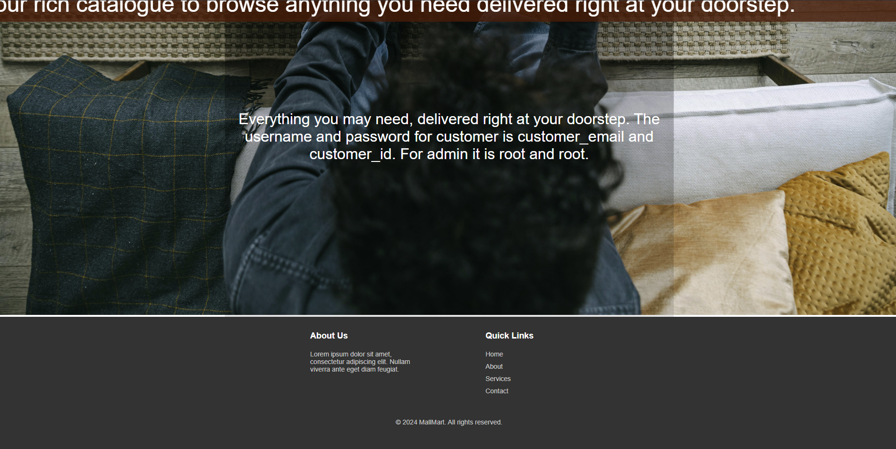

- **Live Demo:** [Check out the site here!](http://mallmartecom.pythonanywhere.com/)

## Project Overview

MallMart is an on paper idea of an E-commerce platform developed using MySQL, Flask, CSS, HTML and some JS & Bootstrap.

## Features

- Explore multiple products in the catalogue.
- View images and multimedia content related to each product.
- Order products and add them to your cart.
- User registration and authentication system.
- Admin panel for site management.

## Project Images
|  |  |
|---------------------------------|---------------------------------|
| *Landing page of MallMart*      | *Landing page and footer*       |

|  |  |
|---------------------------------|-----------------------------------|
| *Login as Admin or Customer*    | *Customer login interface*        |

|  |  |
|---------------------------------|---------------------------------|
| *Product catalogue*             | *Scrollable interface*          |

|  |  |
|---------------------------------|---------------------------------|
| *Product details given*         | *Adding products to cart*       |

|  |  |
|---------------------------------|---------------------------------|
| *View items in your cart*       | *About page*                    |

## Database Diagrams

    

        <h3>Entity-Relationship Diagram</h3>
        
        
<em>ER Diagram illustrating the database structure.</em>

    

    

        <h3>Relational Diagram</h3>
        
        
<em>Relational Diagram showing database tables and relationships.</em>

    

## Technologies Used

- Python
- Flask
- MySQL
- HTML/CSS
- JavaScript

## Installation

To set up and run MallMart locally:

1. Clone the repository from [GitHub](https://github.com/devansh2610/MallMart).
2. Install dependencies using `pip install -r requirements.txt`.
3. Configure your MySQL database settings using the MySQL Workbench or Create a localhost user and password as root.
5. Run the application with `python app.py`.

## Usage

Once the application is running locally:

- Access the application through your browser at `[http://localhost:5000]' through the link displayed in terminal.
- Follow on screen instructions for default usernames and passwords.

## License

This project is licensed under the MIT License - see the [LICENSE](LICENSE) file for details.
